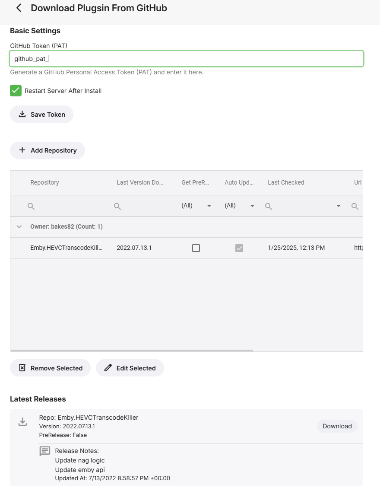
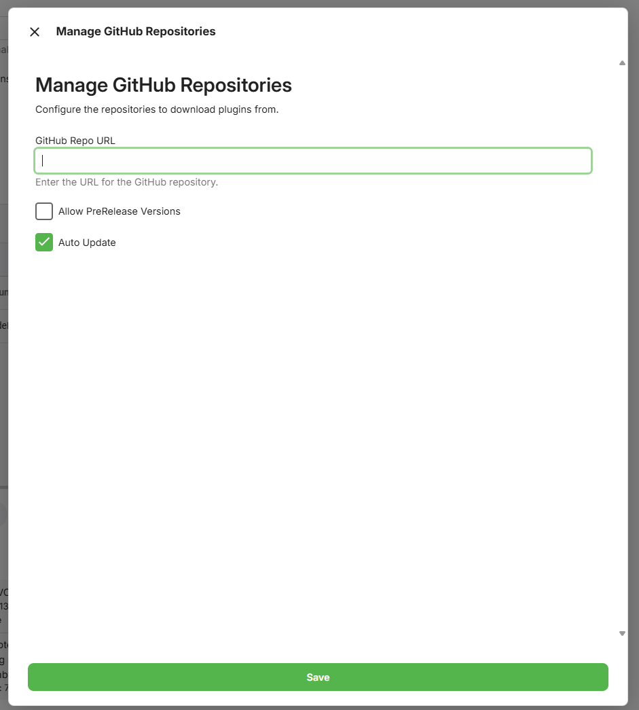
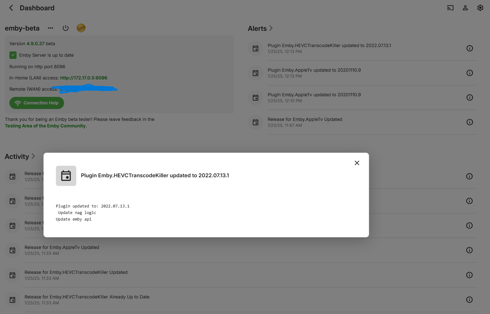

# GitHub Repo Plugin Installer
This plugin allows you to install and manage Emby plugins from GitHub repositories. It automatically pulls the latest releases and installs them as long as there is a .DLL file in the assets. The plugin also supports automatic updates, plugin registries for easy discovery, and bulk operations.

## Features
- 🔄 **Automatic Updates**: Set plugins to auto-update daily via scheduled task
- 📋 **Plugin Registries**: Discover plugins from curated lists
- 🏪 **Built-in Registry**: Comes with a default list of community plugins
- 🔍 **Easy Discovery**: Dropdown selection when adding new repositories
- 📦 **Bulk Operations**: Update all plugins at once or check all for updates
- 🔐 **Private Repository Support**: Works with private repos using GitHub PAT
- 🔄 **Self-Updating**: The plugin can update itself automatically
- 📝 **Activity Logging**: Detailed logs of all plugin operations
- 🎯 **Context-Aware Messages**: Error messages appear near relevant sections

## Configuration

### GitHub Personal Access Token Setup
You need to create a GitHub PAT (Personal Access Token) to use this plugin:

1. 🔑 **Log in to GitHub**: Go to GitHub and log in to your account
2. ⚙️ **Access Developer Settings**:
   - Click your profile picture in the upper-right corner
   - Select "Settings" from the dropdown
   - Scroll down and click "Developer settings" in the left sidebar
3. 🛠 **Generate a Personal Access Token**:
   - Select "Personal access tokens" → "Tokens (classic)"
   - Click "Generate new token"
   
   **Important Scopes to Select:**
   - ✅ **repo** - Required for accessing private repositories (includes all repo permissions)
   - ✅ **read:org** - Required if accessing private repos in organizations
   
   💡 For public repositories only, you can use a token with no scopes, but it's recommended to at least have basic read access.

### Adding Repositories

#### Method 1: From Plugin Registry (Recommended)
1. Navigate to the plugin configuration page
2. Under "Select from Registry", choose a plugin from the dropdown
3. The URL will be automatically populated
4. Configure auto-update and pre-release settings as desired
5. Click OK to add the repository

#### Method 2: Manual Entry
1. Add the repository URL manually in the format: `https://github.com/owner/repository`
2. Set auto-update option (optional) - checks for updates every 24 hours by default
3. Set allow pre-release versions (optional)

### Plugin Registries

The plugin comes with a built-in registry containing popular community plugins. You can also add custom registries:

1. **View Registries**: See all configured registries in the "Plugin Registries" section
2. **Add Registry**: Click "Add Registry" to add a new plugin registry source
3. **Manage Registries**: Edit or remove registries (built-in registry cannot be modified)

#### Registry Features
- 🔒 **Built-in Protection**: The default registry cannot be edited or removed
- 🔄 **Duplicate Prevention**: Same plugin URLs from multiple registries are automatically deduplicated
- 📊 **Source Tracking**: See which registry each plugin comes from
- ⚡ **Real-time Updates**: Registry changes are reflected immediately in the dropdown

## Advanced Features

### Bulk Operations
- **Update All Plugins**: Updates all plugins that have newer versions available
- **Check All for Updates**: Refreshes the release information for all repositories
- **Smart Restart Notifications**: Only prompts for restart when plugin files are actually modified

### Self-Updating
The plugin automatically adds itself to the repository list for self-updating, ensuring you always have the latest features and bug fixes.

### Activity Logging
Detailed activity logs show:
- Successful plugin installations and updates
- Authentication failures with helpful suggestions
- Repository access issues (404, 403 errors)
- File operations and restart notifications

## Creating Your Own Plugin Registry

You can host your own `plugins.json` file and share it with others:

### 1. Create the JSON File

Create a `plugins.json` file with this structure:

```json
{
  "name": "My Plugin Registry",
  "description": "Custom collection of Emby plugins",
  "plugins": [
    {
      "name": "My Awesome Plugin",
      "description": "Does something awesome for Emby",
      "url": "https://github.com/username/my-awesome-plugin"
    },
    {
      "name": "Another Great Plugin", 
      "description": "Another useful Emby plugin",
      "url": "https://github.com/username/another-plugin"
    }
  ]
}
```

### 2. Host the File

#### Option A: GitHub Repository (Recommended)
1. Create a new GitHub repository (e.g., `my-emby-plugins`)
2. Add your `plugins.json` file to the repository
3. Get the raw URL: `https://raw.githubusercontent.com/username/my-emby-plugins/main/plugins.json`

#### Option B: GitHub Gist
1. Create a public GitHub Gist
2. Add your `plugins.json` file
3. Get the raw URL from the Gist

#### Option C: Other Hosting
Any publicly accessible URL that returns the JSON file will work (your own web server, cloud storage, etc.)

### 3. Share Your Registry

Share the raw URL with others. They can add it by:
1. Going to the plugin configuration page
2. Clicking "Add Registry" 
3. Entering your registry name and the raw URL
4. Enabling the registry

### Registry Best Practices
- ✅ **Test URLs**: Ensure all plugin repository URLs are valid and accessible
- ✅ **Clear Descriptions**: Write helpful descriptions for each plugin
- ✅ **Keep Updated**: Regularly review and update your plugin list
- ✅ **Use HTTPS**: Always use secure URLs for better reliability
- ✅ **Validate JSON**: Ensure your JSON file is properly formatted

## Screenshots


*Main plugin management interface with registry support*

 
*Adding repositories with registry dropdown selection*


*Detailed activity logs for all plugin operations*

## Troubleshooting

### Common Issues
- **401 Unauthorized**: Check your GitHub token has the correct scopes
- **404 Not Found**: Verify repository exists and token has access (for private repos)
- **No DLL Assets**: Plugin releases must contain .DLL files to be installable
- **Registry Not Loading**: Verify the registry URL returns valid JSON

### Support
For issues, feature requests, or questions, please visit the [GitHub repository](https://github.com/bakes82/Emby.GitHubRepoPluginInstall) and create an issue.